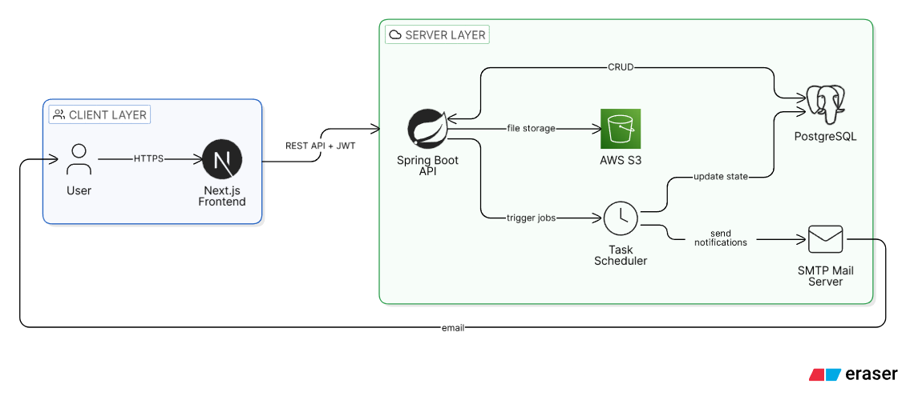

# Time Capsule

[](https://nextjs.org/)
[](https://spring.io/projects/spring-boot)
[](https://www.oracle.com/java/)
[](https://tailwindcss.com/)
[](https://www.postgresql.org/)

**Time Capsule** is a meaningful web application designed to preserve memories and deliver them to your future self or loved ones. Create sealed digital capsules containing messages, photos, and notes, and schedule them to be revealed at any future date.


## Table of Contents

- [About](#about)
- [Features](#features)
- [Tech Stack](#️tech-stack)
- [Architecture](#️architecture)
- [Project Structure](#project-structure)
- [Screenshots](#screenshots)
- [Getting Started](#getting-started)
- [Configuration](configuration)
- [Security](#security)
- [Database Schema](#database-schema)
- [How to Contribute?](#how-to-contribute)
- [What's Next?](#️what's-next)
- [Author](#author)

## About

In an era of instant gratification, **Time Capsule** encourages slow, intentional memory keeping. Whether it's a letter to yourself one year from now, a shared memory vault for a graduating friend group, or a collection of milestones for a newborn, Time Capsule provides a secure and nostalgic way to bridge the gap between present and future.

## Features

- **Scheduled Unlocking**: Capsules remain strictly sealed until the user-defined unlock date.
- **Custodian Network**: Invite collaborators to contribute to your capsule or viewers to wait for its reveal.
- **Multimedia Support**: Attach text, high-quality images, and files to your memory vault.
- **Smart Notifications**: Receive automated email notifications the moment a capsule unlocks.
- **Secure Persistence**: Stateless authentication with Hybrid JWT Approach ensures your memories are for your eyes only.
- **Public Vaults**: Explore public time capsules shared by the owners to you.
- **File Storage**: Secure file storage using Amazon S3.
- **File Encryption**: AES-128 archival encryption applied at source node.
- **Caching and Logging**: Implemented caching and logging to improve performance and debugging.
- **Interactive Documentation**: Interactive API documentation using Swagger UI.
- **Responsive Design**: A fluid, glassmorphic UI optimized for both desktop and mobile.

## Tech Stack

### Frontend

- **Framework**: [Next.js 14](https://nextjs.org/) (App Router)
- **Library**: [React 18](https://react.dev/)
- **Styling**: [Tailwind CSS](https://tailwindcss.com/) + [Radix UI](https://www.radix-ui.com/)
- **State Management**: [Zustand](https://zustand-demo.pmnd.rs/)
- **Forms & Validation**: [React Hook Form](https://react-hook-form.com/) + [Zod](https://zod.dev/)
- **Icons**: [Hugeicons](https://hugeicons.com/) + [Lucide React](https://lucide.dev/)

### Backend

- **Framework**: [Spring Boot 3.x](https://spring.io/projects/spring-boot)
- **Language**: [Java 21](https://www.oracle.com/java/)
- **Auth**: Spring Security + JWT (Stateless)
- **Database**: [PostgreSQL](https://www.postgresql.org/) (Primary)
- **ORM**: Spring Data JPA + Hibernate
- **Migrations**: [Flyway](https://flywaydb.org/)
- **Storage**: Amazon S3 (Scalable file storage)
- **Scheduling**: Spring `@Scheduled` for background job processing

## Architecture

The system follows a classic client-server architecture with clear separation of concerns:



## Project Structure

```bash
time-capsule/
├── backend/                  # Spring Boot Maven Project
│   ├── src/main/java/com/akshansh/timecapsulebackend/
│   │   ├── config/           # Application & Security configuration
│   │   ├── controller/       # REST Endpoints
│   │   ├── exception/        # Custom exceptions
│   │   ├── filter/           # Filters
│   │   ├── mapper/           # Mapper classes
│   │   ├── model/            # JPA Entities & DTOs
│   │   ├── repository/       # Data Access Layer
│   │   ├── security/         # Auth filter
│   │   ├── service/          # Business logic & Scheduled tasks
│   │   └── util/            # Utility classes
│   └── src/main/resources/   # App properties & Flyway scripts
└── frontend/                 # Next.js Application
    ├── src/
    │   ├── app/              # Routes & Pages
    │   ├── components/       # Reusable UI components
    │   ├── lib/              # API clients & Constants
    │   ├── store/            # Zustand state stores
    │   └── types/            # TypeScript definitions
    └── tailwind.config.ts    # Styling configuration
```

## Screenshots

- Dashboard
  

- Create Capsule
  

- View Capsule
  

- Login Page
  

- Email Notification
  

## Getting Started

### Prerequisites

- **Java 21** & **Maven**
- **Node.js 18+** & **npm/pnpm**
- **PostgreSQL** instance

### Setup Backend

1. Navigate to `/backend`.
2. Configure `.env` or `application.properties` with your DB and SMTP credentials.
3. Run the application:
   ```bash
   mvn spring-boot:run
   ```

### Setup Frontend

1. Navigate to `/frontend`.
2. Install dependencies:
   ```bash
   npm install
   ```
3. Configure `.env.local` with your Backend API URL.
4. Start the development server:
   ```bash
   npm run dev
   ```

## Configuration

### Backend (`application.properties`)

- `spring.datasource.username` = ${DB_USERNAME}
- `spring.datasource.password` = ${DB_PASSWORD}
- `spring.datasource.url` = ${DB_URL}
- `jwt.secret-key` = ${JWT_SECRET_KEY}
- `spring.mail.username` = ${MAIL_USERNAME}
- `spring.mail.password` = ${MAIL_PASSWORD}
- `aws.bucket.name` = ${S3_BUCKET_NAME}
- `aws.accessKey` = ${AWS_ACCESS_KEY}
- `aws.secretKey` = ${AWS_SECRET_KEY}
- `resend.api.key` = ${RESEND_API_KEY}
- `resend.from.email` = ${RESEND_FROM_EMAIL}

### Frontend (`.env.local`)

- `NEXT_PUBLIC_API_URL`: Base URL of your backend.

## Security

- **Hybrid JWT Authentication**: Access tokens + Stored Refresh tokens in DB. Secure, stateless user sessions.
- **Resource Privacy**: Capsules are protected at the data layer; locked content is inaccessible until the unlock date passes.
- **Role-Based Access**: Granular control via `OWNER`, `CONTRIBUTOR`, and `VIEWER` roles.
- **Input Sanitization**: Strictly validated payloads using Zod and Spring Validation.

## Database Schema


## How to Contribute?

Contributions are welcome! Please follow these steps:

1. Fork the project.
2. Create your Feature Branch (`git checkout -b feature/AmazingFeature`).
3. Commit your changes (`git commit -m 'Add some AmazingFeature'`).
4. Push to the branch (`git push origin feature/AmazingFeature`).
5. Open a Pull Request.

## What's Next?

- [ ] **Dockerization**: Full-stack containerization for one-click deployment.
- [ ] **Multimedia Player**: In-app song player for audio memories.
- [ ] **Advanced Filtering**: Search and filter public vaults by nostalgia categories.

## Author

**Akshansh**

- GitHub: [@akshansh029](https://github.com/Akshansh029)
- LinkedIn: [akshanshsingh](https://www.linkedin.com/in/akshansh-singh-3b6718250/)
